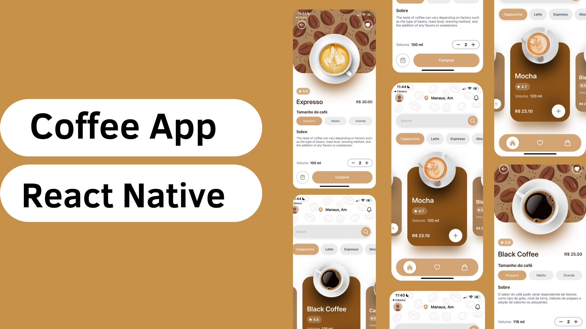

# Coffee-App-React-Native

![Image]

  
 
  

## Execute o App

Intale a dependências

### `npm install` or `yarn install`

## Then

Inicie o App

### `npm start`

Runs your app in development mode.

Abra-o no [Expo](https://expo.io) no seu telefone para visualizá-lo. Ele será recarregado se você salvar as edições em seus arquivos e você verá erros de compilação e logs no terminal.

#### `npm run ios` or `yarn run ios`

 `npm start` / `yarn start`, mas também tenta abrir seu aplicativo no simulador iOS se você estiver em um Mac e o tiver instalado.

#### `npm run android` or `yarn run android`

 `npm start` / `yarn start`, mas também tenta abrir seu aplicativo em um dispositivo ou emulador Android conectado. Requer uma instalação de ferramentas de compilação do Android ( [React Native docs](https://facebook.github.io/react-native/docs/getting-started.html) para configuração detalhada).

 

